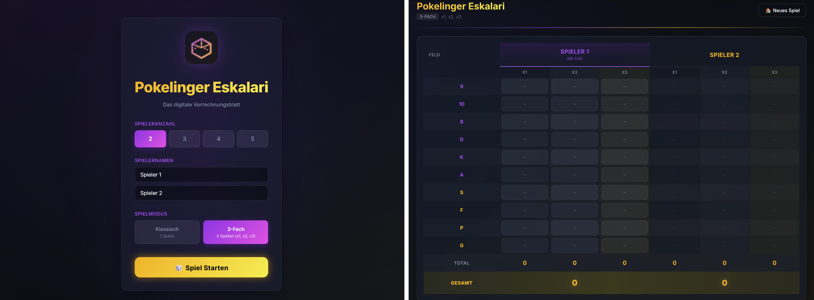

# 🎲 Pokelinger Eskalari

**Pokelinger Eskalari** is a premium digital scorebook for the popular dice game. It replaces traditional paper scorecards with a modern, interactive, and visually stunning web application.



---

## ✨ Features

- **🏆 Professional Scoring System**: Complete implementation of Eskalero rules including numbers (9-A), Specials (Straße, Full House, Poker, Grande), and the "Serviert" bonus.
- **⚡ Dual Game Modes**:
  - **Klassisch**: The standard 1-column experience.
  - **3-Fach**: The advanced challenge with 3 columns and automatic multipliers (x1, x2, x3).
- **🎨 Premium UX/UI**:
  - **Dark Mode**: Sleek glassmorphism design that's easy on the eyes.
  - **Micro-animations**: Smooth transitions, hover effects, and feedback animations.
  - **Responsive Design**: Play on your phone, tablet, or desktop with equal comfort.
- **🧙 Scoring Wizard**: Intelligent modals for score entry, including count-based input for numbers and specialized selection for straights and poker.
- **🔄 Turn Management**: Automatic turn tracking ensures every player stays in sync.
- **🥇 Victory Screen**: Victory screen with winner score and celebration.

## 🛠️ Tech Stack

- **Core**: [React 19](https://react.dev/)
- **Logic**: [TypeScript](https://www.typescriptlang.org/)
- **Build Tool**: [Vite](https://vitejs.dev/)
- **Styling**: Vanilla CSS (Custom Variable Design System)
- **State**: React Context API

## 🚀 Getting Started

### Prerequisites

- [Node.js](https://nodejs.org/) (v18 or higher recommended)
- [npm](https://www.npmjs.com/) or [yarn](https://yarnpkg.com/)

### Installation

1. Clone the repository:
   ```bash
   git clone https://github.com/your-username/pokelinger-eskalari.git
   cd pokelinger-eskalari
   ```

2. Install dependencies:
   ```bash
   npm install
   ```

3. Start the development server:
   ```bash
   npm run dev
   ```

4. Build for production:
   ```bash
   npm run build
   ```

## 📂 Project Structure

- `src/components`: UI components (Setup, Game Board, Modals, Victory).
- `src/context`: Global game state management.
- `src/types`: TypeScript definitions for game logic.
- `src/utils`: Helper functions for score calculations.
- `src/index.css`: The "Premium Design System" and core styles.

---

*Made with ❤️ for dice enthusiasts everywhere.*
